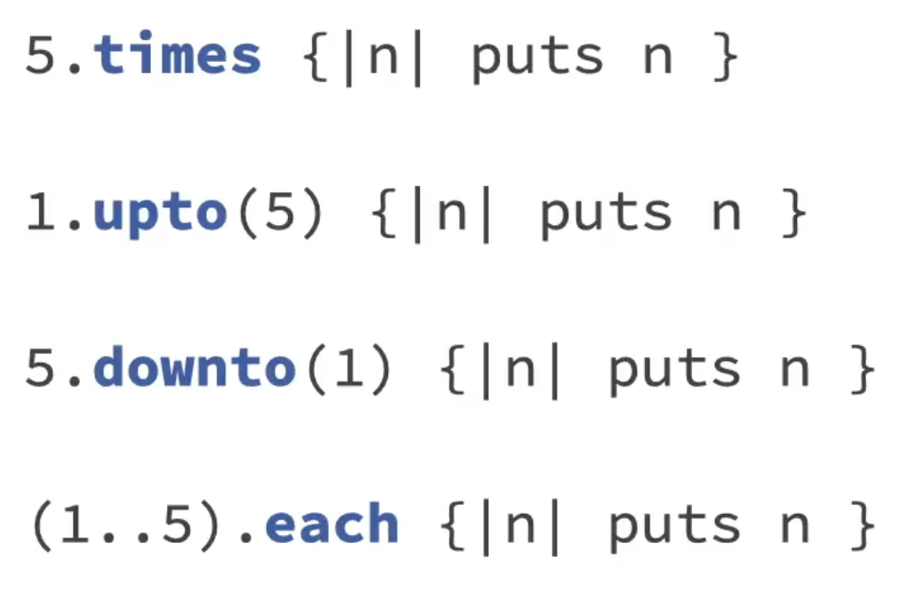
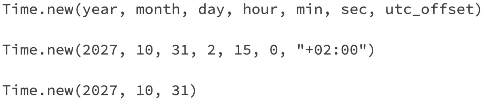
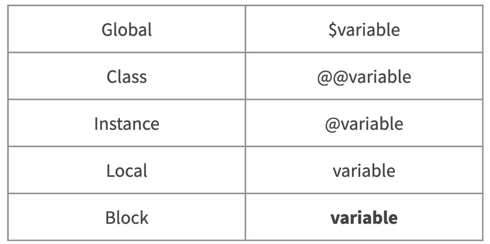
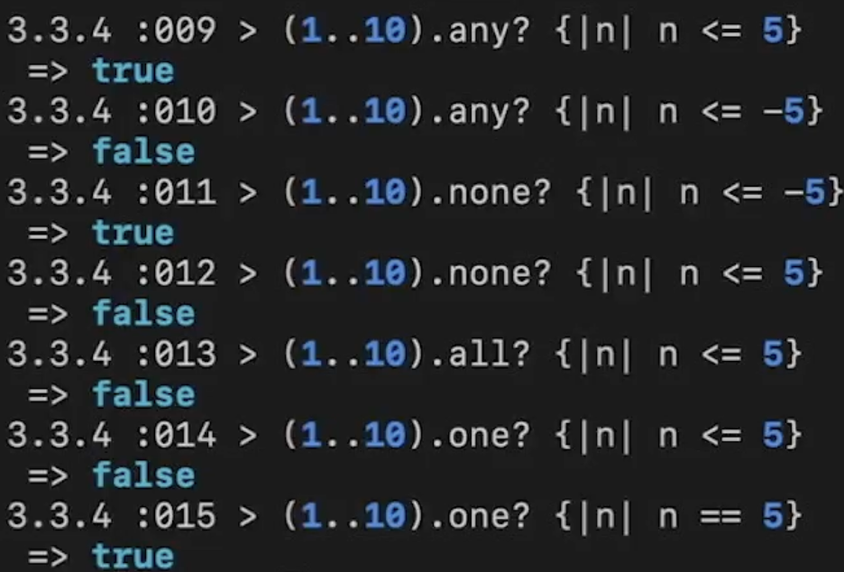
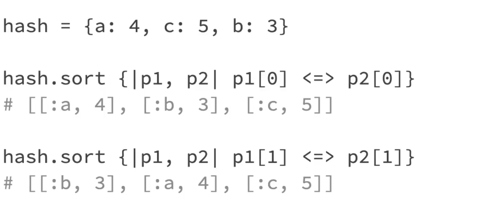
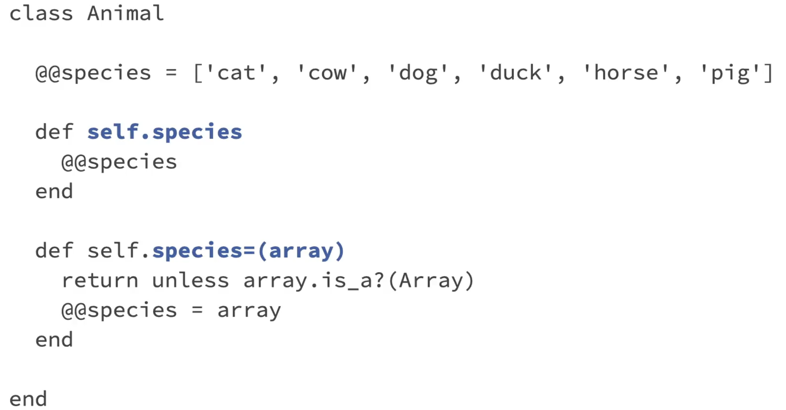

### Integers

Numbers have methods like next, abs, .. Both float and integer originate from Numeric
Conversion : to_f, to_i (floor if there is float)

### Strings

to_s, to_i (can call on strings), capitalize, upcase, downcase, reverse(with bang, modifies the original object)
Every method returns an object. Interpolation is not possible in single quoted string. (#{})

- str.split('delimiter') -> returns an array

### Arrays

arr = [] and arr[5] = 10 works and array can have diff types of objects inside it.
arr[ind,len] , arr[f_ind..l_ind]

- arr.each_index { |i| puts i }
- arr.compact - removes empty positions
- arr.uniq - removes duplicate elements
- arr.include?(ele) - true or false
- arr.delete_at(ind) & arr.delete(ele)
- arr.flatten
- arr.join(<delimiter>)
- arr.first && arr.last
- arr.push(ele) && arr.pop
- arr.shift (deque) && arr.unshift(ele)

### Hash - hanging file folders

Order not important {key => value}
has_key?()
has_value?()

### Symbols

:name - memory save - has to do something with garbage collector
{sym_name : value} (no need of : infornt of sym_name)

### Booleans


### Ranges

inclusive ranges : [1..10] 1 to 10
exclusive ranges : [1...10] 1 to 9

range = 'a..z'
array = [*range] => \* splat operator - expands out the range to array

##### Constants

ALL_CAPS_ARE_CONSTANTS

### If and Unless

if product.visible?
end

unless product.sold_out?
end

unless cart.empty? # unless this stmt is true
end

### Iterators



#### By class



#### Include #!/usr/bin/env ruby to let the unix to use ruby compiler (to make the code portable to any system)

### Ruby scripting

exit (some advanced ruby stuff can prevent this exit from happening) && exit! (no one can stop me)
abort("exit with a message")

print # without a line return
puts # with a line return
chop # pops the last char
chomp #pops the last char only if its newline

### Dates


Time
yday - day of the year , wday - day of the week, sunday?,.. , strftime, zone, utc?, gmt?..


Date library
require "date"
leap?, cweek, cday (calendar week, calendar day)
Date.today, Time.now, to_date(), to_time(), next_day, next_year,...

### Enumerable

Things which can be counted, like array, maps,... (strings are sorta enumerable)

### Scope



### find && Map


Map needs to return elements (if else condition), map! changes the actual array

### Inject/ Reduce

Similar to reduce, use of accumulator
arr.inject(memo_init_val) {|memo, n| memo+n} -> no initial value means, the memo will take the 0th ind and start oper from 1st ind

### Sorting

v1 <=> v2

arr.sort {|a,b| a<=>b}
arr.sort_by { |a| a.lenght } -> slower

Hashing sort


### Merge 
1. Without a block
h1.merge(h2) -> picks up values from h2 if there is any collision
2. With a block
h1.merge(h2) {|key,old, new| new}

code block will be called when there is key conflict

### Methods
- Variables declared outside the method cannot be accessed by the method
- When we have a lot of arguments as options to pass, we can use hash of options 
like def func(arg= {}) and use it like option1 = arg[:key] || defualt value
- Methods return the value of last operation in the method.

### Classes

require_relative 'classes/person' - required to import classes
An instance has access to the instance variable but instance variables (@...) cant be accessed outside the instance  
For an instance varible @noise,
```
attr_accessor :noise, :sound

#getter
def noise
  @noise
end

#setter
def noise = (val) 
  @noise = val
end
```

``puts sprintf("$%.2f", ring.price) # $35.10``

 #### Attribute methods

 1. attr_reader
 2. attr_writer
 3. attr_accessor (both reader and writer)
  


### Radio challenge (good code)

```ruby
class Radio
  
  attr_reader :volume, :band

  @@fm_frequencies = 88.0..108.0
  @@am_frequencies = 540.0..1600.0

  @@default_fm_freq = 95.5
  @@default_am_freq = 1010.0
  
  def self.am(options={})
    options.merge!({band: 'AM'})
    Radio.new(options)
  end
  
  def self.fm(options={})
    options.merge!({band: 'FM'})
    Radio.new(options)
  end
  
  def initialize(options={})
    self.volume = options[:volume] || 5
    self.band = options[:band] || 'FM'
    @am_frequency = @@default_am_freq
    @fm_frequency = @@default_fm_freq
    self.frequency = options[:frequency]
  end
  
  def volume=(value)
    return if value < 1 || value > 10
    @volume = value
  end

  def band=(value)
    return unless ['AM', 'FM'].include?(value)
    @band = value
  end

  def frequency
    @band == 'AM' ? @am_frequency : @fm_frequency
  end

  def frequency=(value)
    # convert to float in case a string is sent
    value = value.to_f
    return unless allowed_frequencies.include?(value)
    if @band == 'AM'
      @am_frequency = value
    else
      @fm_frequency = value
    end
  end
  
  def status
    "station: #{frequency} #{band}, volume: #{volume}"
  end
  
  private
  
    def allowed_frequencies
      @band == 'AM' ? @@am_frequencies : @@fm_frequencies
    end
  
end
```

# To use Enumerable as a mixin, a class must define #each


# Files
To get instance - use File.new and open doesnot provide instance