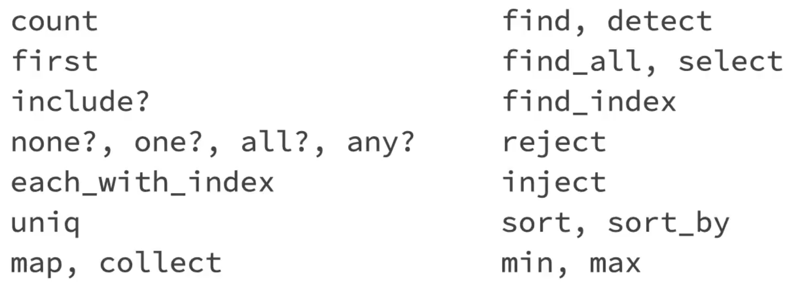
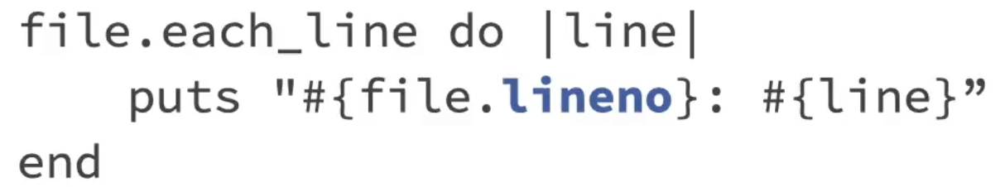
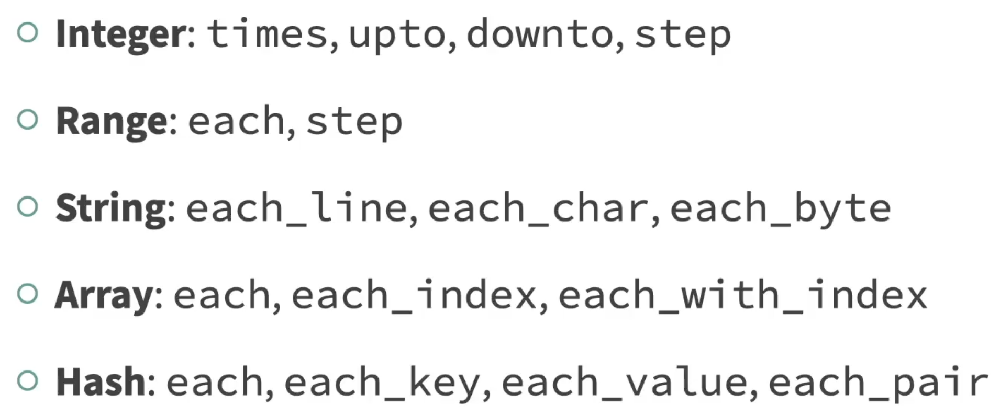
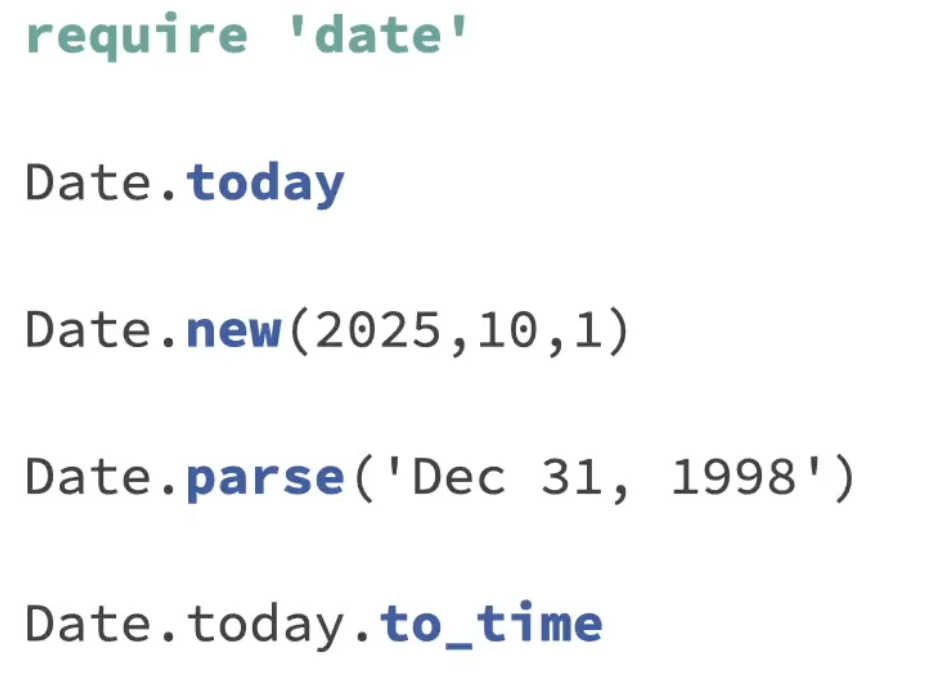
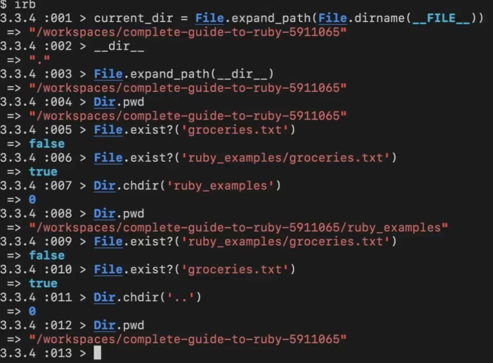

### Integers

Numbers have methods like next, abs, .. Both float and integer originate from Numeric
Conversion : to_f, to_i (floor if there is float)

### Strings

to_s, to_i (can call on strings), capitalize, upcase, downcase, reverse(with bang, modifies the original object)
Every method returns an object. Interpolation is not possible in single quoted string. (#{})

- str.split('delimiter') -> returns an array

### Arrays

arr = [] and arr[5] = 10 works and array can have diff types of objects inside it.
arr[ind,len] , arr[f_ind..l_ind]

- arr.each_index { |i| puts i }
- arr.compact - removes empty positions
- arr.uniq - removes duplicate elements
- arr.include?(ele) - true or false
- arr.delete_at(ind) & arr.delete(ele)
- arr.flatten
- arr.join(<delimiter>)
- arr.first && arr.last
- arr.push(ele) && arr.pop
- arr.shift (deque) && arr.unshift(ele)

### Hash - hanging file folders

Order not important {key => value}
has_key?()
has_value?()

### Symbols

:name - memory save - has to do something with garbage collector
{sym_name : value} (no need of : infornt of sym_name)

### Booleans

### Ranges

inclusive ranges : [1..10] 1 to 10
exclusive ranges : [1...10] 1 to 9

range = 'a..z'
array = [*range] => \* splat operator - expands out the range to array

##### Constants

ALL_CAPS_ARE_CONSTANTS

### If and Unless

if product.visible?
end

unless product.sold_out?
end

unless cart.empty? # unless this stmt is true
end

### Iterators

#### By class

#### Include #!/usr/bin/env ruby to let the unix to use ruby compiler (to make the code portable to any system)

### Ruby scripting

exit (some advanced ruby stuff can prevent this exit from happening) && exit! (no one can stop me)
abort("exit with a message")

print # without a line return
puts # with a line return
chop # pops the last char
chomp #pops the last char only if its newline

### Dates

Time
yday - day of the year , wday - day of the week, sunday?,.. , strftime, zone, utc?, gmt?..

Date library
require "date"
leap?, cweek, cday (calendar week, calendar day)
Date.today, Time.now, to_date(), to_time(), next_day, next_year,...

### Enumerable

Things which can be counted, like array, maps,... (strings are sorta enumerable)

### Scope

### find && Map

Map needs to return elements (if else condition), map! changes the actual array

### Inject/ Reduce

Similar to reduce, use of accumulator
arr.inject(memo_init_val) {|memo, n| memo+n} -> no initial value means, the memo will take the 0th ind and start oper from 1st ind

### Sorting

v1 <=> v2

arr.sort {|a,b| a<=>b}
arr.sort_by { |a| a.lenght } -> slower

Hashing sort

### Merge 
1. Without a block
h1.merge(h2) -> picks up values from h2 if there is any collision
2. With a block
h1.merge(h2) {|key,old, new| new}

code block will be called when there is key conflict

